## Network Anomaly/Intrusion Detection Report using KDD Cup 99 Dataset
##Prepared for UMBC Data Science Master Degree Capstone by Dr Chaojie Wang.
##Author - Meghalini Gurram
##Github - https://github.com/Meghalini/UMBC-DATA606-Capstone.git
##LinkedIn - https://www.linkedin.com/in/meghalini-gurram-850b24240
##PPT Link - 
##Youtube Link - https://youtu.be/WH8Xyaq0Byg

## Introduction:
The purpose of this report is to provide an overview of the network anomaly/intrusion detection using the KDD Cup 99 dataset. The KDD Cup 99 dataset is a widely used benchmark dataset for evaluating intrusion detection systems. It contains network traffic data captured from a simulated environment, representing various types of normal and malicious activities.

## Dataset Overview:
The KDD Cup 99 dataset consists of approximately 5 million network connections, divided into four categories: normal, denial of service (DoS), probe, and user-to-root (U2R) attacks. Each network connection is represented by a set of features, including protocol type, service, source and destination addresses, flags, and more. The dataset also provides labels indicating whether each connection is normal or represents a specific type of attack.

### EDA:
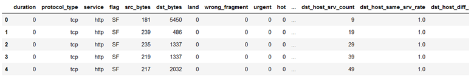

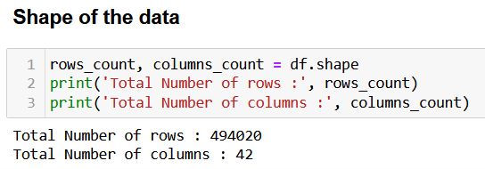

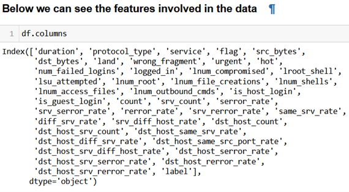

## Describing Data
The standard deviation of balance, duration and pdays is greater than one third of the mean, distrubution would be spreaded out around the mean, we will see this in visualisation section.
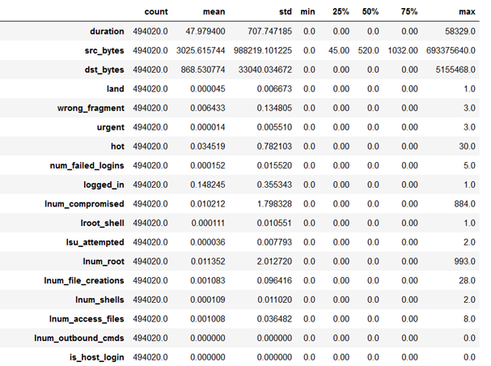

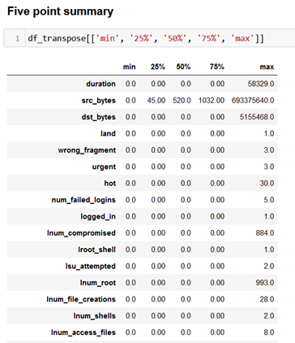

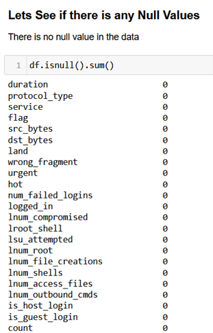

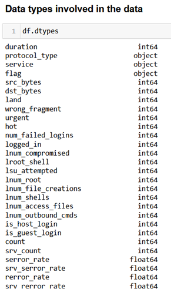

This help us to know that there's various factors on which attacks depends

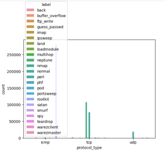

By analysing the above two graphs we came to know that, Most of the UDP and tcp protocols denote the normal traffic. It also means that UDP and TCP are more vulnerable in compare with others. If it is not a guest login then more chance the traffic denotes DOS attack.

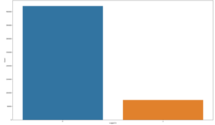

## Correlation
We can observe that Corelations are very less
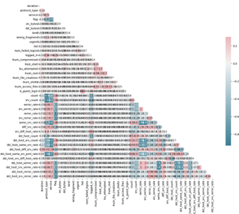

## Preprocessing:
Before conducting the network anomaly/intrusion detection analysis, the KDD Cup 99 dataset requires preprocessing. The preprocessing steps include:
- a. Data Cleaning: Handling missing values, removing duplicates, and addressing any inconsistencies in the dataset.
- b. Feature Selection/Engineering: Identifying relevant features and transforming them into a suitable format for analysis. This step aims to reduce dimensionality and improve the performance of the intrusion detection model.
- c. Data Splitting: Dividing the dataset into training, validation, and testing sets. The training set is used to train the intrusion detection model, the validation set helps in tuning hyperparameters, and the testing set evaluates the final model's performance.

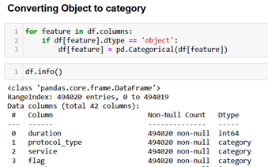

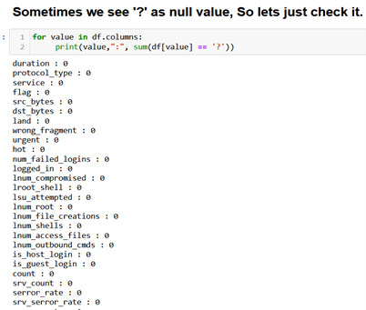

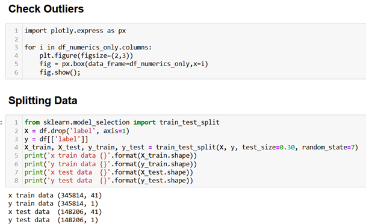

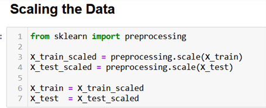

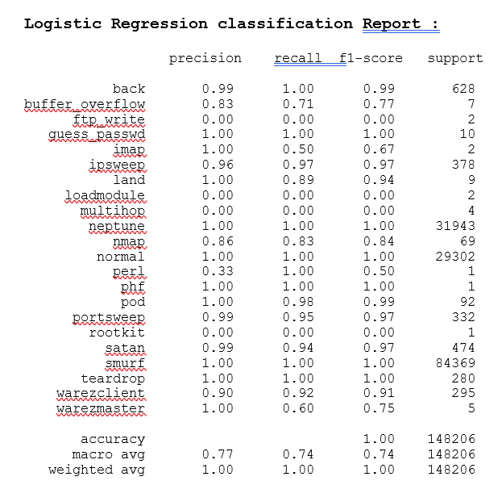

## Network Anomaly/Intrusion Detection Techniques:
There are several techniques that can be employed for network anomaly/intrusion detection using the KDD Cup 99 dataset. Some commonly used techniques include:
- a. Signature-based Detection: Matching network traffic patterns against a database of known attack signatures to identify and categorize malicious activities.
- b. Anomaly-based Detection: Establishing a baseline of normal network behavior and identifying deviations from it. This technique can detect previously unseen or unknown attacks.
- c. Machine Learning-based Detection: Utilizing machine learning algorithms to analyze the dataset and identify patterns associated with different types of attacks. Algorithms such as decision trees, random forests, support vector machines, and deep learning neural networks can be applied.

## We have use Machine Learning Technique:
- •	Logistic Regression is a widely used statistical model for binary classification problems. Contrary to what its name implies, logistic regression is a classification algorithm. It is employed to forecast the likelihood that an instance will belong to a specific class. The model applies the logistic function (also known as the sigmoid function) to the linear combination of input features and their corresponding weights. The output of the logistic function is a value between 0 and 1, which represents the probability of the instance belonging to the positive class. A threshold can be set to make the final classification decision. Logistic regression is relatively simple and interpretable, and it can handle both categorical and numerical features.
- •	K-Nearest Neighbors (KNN) is a non-parametric machine learning algorithm used for both classification and regression tasks. KNN makes predictions by finding the K nearest neighbors of a new data point in the feature space and determining its class or value based on the majority or average of its neighbors. The choice of K determines the influence of neighboring points on the prediction. KNN does not make any assumptions about the underlying data distribution and can handle both numerical and categorical features. However, it can be computationally expensive when dealing with large datasets.
- •	XGBoost (eXtreme Gradient Boosting) is an optimized implementation of the gradient boosting algorithm, which is an ensemble learning method. It is designed to create a strong predictive model by combining weak individual models, typically decision trees. XGBoost trains the models sequentially, where each new model is trained to correct the mistakes of the previous models. It uses gradient descent optimization to minimize a specified loss function and make predictions by aggregating the predictions of all individual models. XGBoost is known for its efficiency, scalability, and performance on a wide range of machine learning tasks. It has become popular in many Kaggle competitions and is widely used in industry.
- •	Neural Networks A family of machine learning models called, commonly referred to as Artificial Neural Networks (ANNs), are modelled after the structure and operation of biological brains. Layers of linked neurons, also known as nodes, make up a neural network. The input layer receives the input data, and the output layer produces the final predictions. In between, there can be one or more hidden layers that extract and transform features from the input. Each neuron takes a weighted sum of its inputs, applies an activation function, and passes the result to the next layer. The weights are adjusted during the training process to minimize a specified loss function. Neural networks are highly flexible and capable of learning complex patterns and relationships in the data. They have achieved remarkable success in various domains such as image and speech recognition, natural language processing, and reinforcement learning. Models with several hidden layers are referred to as deep learning, a type of neural networks that allows for the learning of hierarchical representations of the input.

## Evaluation Metrics:
To assess the performance of the network anomaly/intrusion detection model, the following evaluation metrics can be used:
- a. Accuracy: The proportion of correctly classified instances (both normal and attacks) out of the total instances.
- b. Precision: The proportion of correctly identified attacks out of all instances classified as attacks. It represents the model's ability to avoid false positives.
- c. Recall/Sensitivity: The proportion of correctly identified attacks out of all actual attack instances. It indicates the model's ability to avoid false negatives.
- d. F1 Score: The harmonic mean of recall and accuracy offers an accurate assessment of model performance.

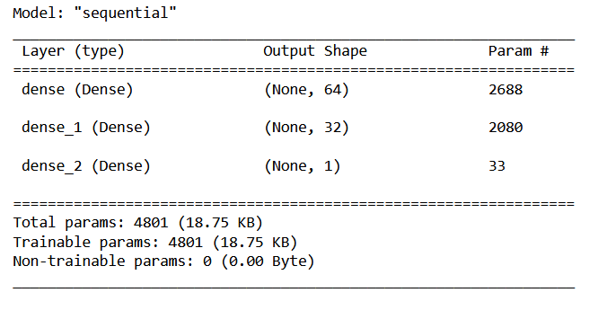

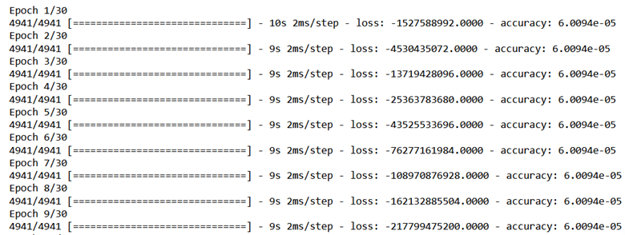

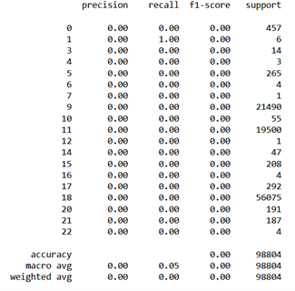

## For XGBOOST After Performing K Fold Cross Validation we got Best Results

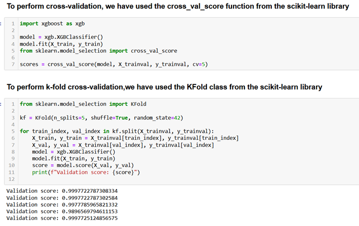

## Conclusion:
### Xgboost model gave better output with highest precision and recall . Following KNN and Logistic Regression.
But Deep Learning Model gave the worst result but we can improve in future by increasing the number of neurons and the hyperparameters.

Network anomaly/intrusion detection plays a crucial role in safeguarding computer networks from unauthorized access and malicious activities. The KDD Cup 99 dataset serves as a valuable resource for developing and evaluating intrusion detection systems.
By employing appropriate preprocessing techniques and employing advanced detection methods such as signature-based, anomaly-based, or machine learning-based approaches, organizations can enhance their ability to detect and respond to network attacks effectively.
It is important to note that the effectiveness of the network anomaly/intrusion detection model depends on continuous monitoring, regular updates, and the incorporation of new attack patterns and techniques. Additionally, the choice of evaluation metrics should align with the specific requirements and priorities of the organization.
In conclusion, the network anomaly/intrusion detection using the KDD Cup 99 dataset provides a solid foundation for developing robust and efficient intrusion detection systems, enabling organizations to proactively protect their network infrastructure from potential threats.

